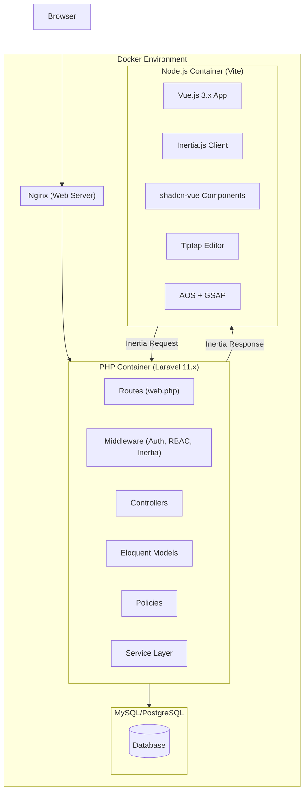
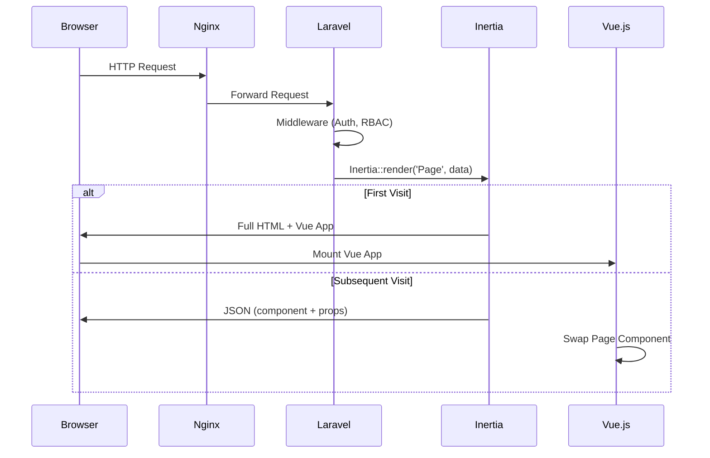
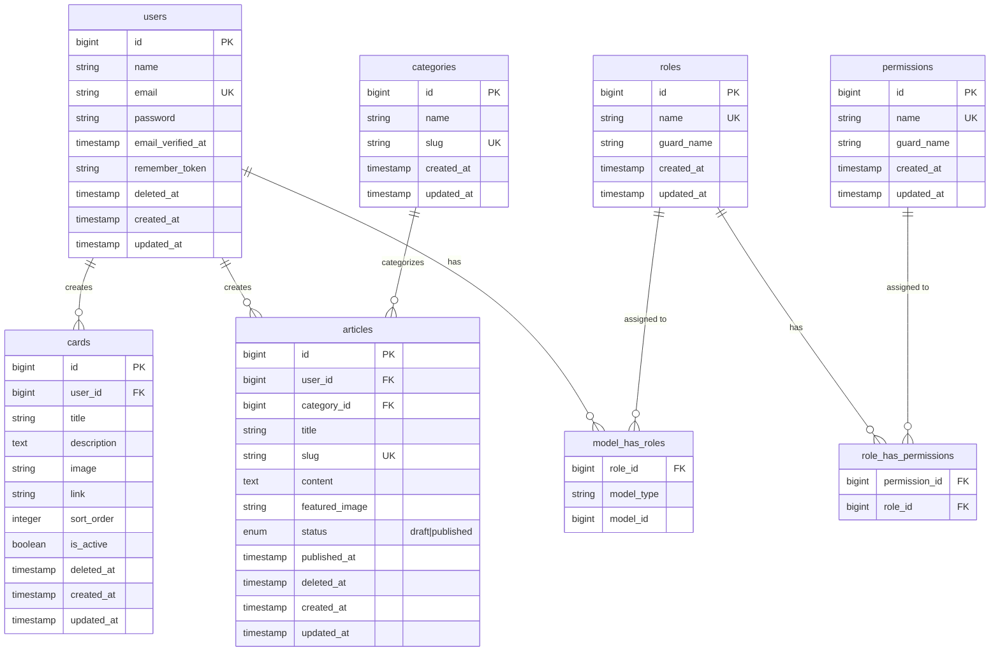

# Dokumen Design — Laravel + Vue.js CMS Landing Page

## Overview

Dokumen ini menjelaskan desain teknis untuk template fullstack CMS dan Landing Page menggunakan Laravel 11.x, Vue.js 3.x, dan Inertia.js. Sistem terdiri dari dua bagian utama:

1. **CMS (Content Management System)** — Antarmuka admin yang dilindungi autentikasi dengan Role-Based Access Control (RBAC) untuk mengelola konten (artikel, card components), pengguna, dan pengaturan sistem.
2. **Landing Page Publik** — Halaman publik yang menampilkan konten dinamis dari CMS dengan animasi modern menggunakan AOS dan GSAP.

### Keputusan Desain Utama

| Keputusan          | Pilihan                      | Alasan                                                                                                 |
| ------------------ | ---------------------------- | ------------------------------------------------------------------------------------------------------ |
| Backend Framework  | Laravel 11.x                 | Framework PHP terpopuler dengan ekosistem matang, built-in auth, ORM Eloquent, dan dukungan Inertia.js |
| Frontend Framework | Vue.js 3.x (Composition API) | Reactive, ringan, dan terintegrasi sempurna dengan Inertia.js                                          |
| SPA Bridge         | Inertia.js                   | Menghilangkan kebutuhan API terpisah, routing tetap di server-side                                     |
| RBAC               | spatie/laravel-permission    | Package standar industri untuk role & permission management di Laravel                                 |
| UI Components      | shadcn-vue                   | Component library modern, accessible, dan customizable berbasis Radix Vue + Tailwind CSS               |
| Rich Text Editor   | Tiptap (@tiptap/vue-3)       | Editor berbasis ProseMirror, extensible, dan memiliki integrasi shadcn-vue (tiptap-shadcn-vue)         |
| CSS Framework      | Tailwind CSS 3.x/4.x         | Utility-first CSS yang konsisten dengan shadcn-vue                                                     |
| Animasi            | AOS + GSAP                   | AOS untuk scroll-triggered animations, GSAP untuk animasi kompleks dan smooth scrolling                |
| Containerization   | Docker + Docker Compose      | Environment development yang konsisten dan reproducible                                                |
| Build Tool         | Vite                         | Fast HMR, native ESM support, standar bawaan Laravel                                                   |

## Architecture

### Arsitektur Tingkat Tinggi

Sistem menggunakan arsitektur **monolith** dengan Inertia.js sebagai bridge antara Laravel backend dan Vue.js frontend. Tidak ada API terpisah — Inertia menangani komunikasi antara server dan client melalui JSON responses.



### Request Flow



### Pembagian Modul

| Modul              | Tanggung Jawab                                   | Layer                         |
| ------------------ | ------------------------------------------------ | ----------------------------- |
| Auth Module        | Login, logout, session management, CSRF          | Backend + Frontend            |
| RBAC Module        | Role management, permission checking, middleware | Backend                       |
| User Management    | CRUD pengguna, assign role                       | Backend + Frontend            |
| Content Management | CRUD artikel, CRUD card, publish/draft           | Backend + Frontend            |
| Landing Page       | Render konten publik, animasi                    | Frontend                      |
| Utility Module     | Validasi, date formatting, string manipulation   | Frontend (+ Backend validasi) |
| Docker Module      | Container orchestration, environment config      | Infrastructure                |

## Components and Interfaces

### Backend Components (Laravel)

#### 1. Auth Module

```
app/Http/Controllers/Auth/
├── LoginController.php        # Handle login/logout
├── AuthenticatedSessionController.php
```

- **LoginController**: Menangani form login, validasi kredensial, pembuatan session, dan logout.
- Menggunakan Laravel built-in `Auth` facade dan session driver.
- CSRF protection otomatis melalui `VerifyCsrfToken` middleware.

**Interface:**

```php
// Routes
POST /login          → AuthenticatedSessionController@store
POST /logout         → AuthenticatedSessionController@destroy
GET  /login          → AuthenticatedSessionController@create
```

#### 2. RBAC Module (spatie/laravel-permission)

```
app/Http/Middleware/
├── HandleInertiaRequests.php   # Share auth & role data ke frontend
├── CheckRole.php               # Custom middleware untuk role checking
```

- Menggunakan `spatie/laravel-permission` v6 untuk manajemen role dan permission.
- Tiga role: `super-admin`, `admin`, `user`.
- Middleware `role:super-admin` pada route User Management.
- Middleware `role:super-admin|admin` pada route Content Management (write).
- Middleware `role:super-admin|admin|user` pada route Content Management (read).

**Permission Matrix:**

| Fitur                      | Super Admin | Admin | User |
| -------------------------- | ----------- | ----- | ---- |
| User Management (CRUD)     | ✅          | ❌    | ❌   |
| ACL Settings               | ✅          | ❌    | ❌   |
| Content Create/Edit/Delete | ✅          | ✅    | ❌   |
| Content View               | ✅          | ✅    | ✅   |
| Dashboard                  | ✅          | ✅    | ✅   |

#### 3. User Management Module

```
app/Http/Controllers/
├── UserController.php          # CRUD pengguna
app/Models/
├── User.php                    # Model dengan HasRoles trait
app/Policies/
├── UserPolicy.php              # Authorization policy
```

**Interface:**

```php
// Routes (protected: role:super-admin)
GET    /cms/users               → UserController@index
GET    /cms/users/create        → UserController@create
POST   /cms/users               → UserController@store
GET    /cms/users/{user}/edit   → UserController@edit
PUT    /cms/users/{user}        → UserController@update
DELETE /cms/users/{user}        → UserController@destroy
```

#### 4. Content Management Module

```
app/Http/Controllers/
├── ArticleController.php       # CRUD artikel
├── CardController.php          # CRUD card components
app/Models/
├── Article.php                 # Model artikel dengan SoftDeletes
├── Card.php                    # Model card dengan SoftDeletes
├── Category.php                # Model kategori
app/Services/
├── SlugService.php             # Generate unique slug dari judul
├── MediaService.php            # Handle upload dan resize gambar
```

**Interface:**

```php
// Article Routes (protected: role:super-admin|admin untuk write)
GET    /cms/articles            → ArticleController@index
GET    /cms/articles/create     → ArticleController@create
POST   /cms/articles            → ArticleController@store
GET    /cms/articles/{article}/edit → ArticleController@edit
PUT    /cms/articles/{article}  → ArticleController@update
DELETE /cms/articles/{article}  → ArticleController@destroy

// Card Routes (protected: role:super-admin|admin untuk write)
GET    /cms/cards               → CardController@index
GET    /cms/cards/create        → CardController@create
POST   /cms/cards               → CardController@store
GET    /cms/cards/{card}/edit   → CardController@edit
PUT    /cms/cards/{card}        → CardController@update
DELETE /cms/cards/{card}        → CardController@destroy
PATCH  /cms/cards/reorder       → CardController@reorder
```

#### 5. Landing Page Module (Public)

```
app/Http/Controllers/
├── LandingPageController.php   # Serve landing page data
```

**Interface:**

```php
// Public Routes (tanpa auth)
GET /                           → LandingPageController@index
GET /articles/{slug}            → LandingPageController@showArticle
```

### Frontend Components (Vue.js)

#### Layout Components

```
resources/js/Layouts/
├── CmsLayout.vue               # Layout utama CMS (sidebar, navbar, content area)
├── GuestLayout.vue             # Layout untuk halaman login
├── LandingLayout.vue           # Layout untuk landing page publik
```

#### Page Components

```
resources/js/Pages/
├── Auth/
│   └── Login.vue               # Halaman login
├── Cms/
│   ├── Dashboard.vue           # Dashboard CMS
│   ├── Users/
│   │   ├── Index.vue           # Daftar pengguna
│   │   ├── Create.vue          # Form buat pengguna
│   │   └── Edit.vue            # Form edit pengguna
│   ├── Articles/
│   │   ├── Index.vue           # Daftar artikel
│   │   ├── Create.vue          # Form buat artikel (dengan Tiptap)
│   │   └── Edit.vue            # Form edit artikel
│   └── Cards/
│       ├── Index.vue           # Daftar card
│       ├── Create.vue          # Form buat card
│       └── Edit.vue            # Form edit card
├── Landing/
│   ├── Index.vue               # Landing page utama
│   └── ArticleDetail.vue       # Detail artikel
```

#### Reusable Components

```
resources/js/Components/
├── UI/                         # shadcn-vue components (auto-generated)
│   ├── Button.vue
│   ├── Input.vue
│   ├── Card.vue
│   ├── Dialog.vue
│   ├── Table.vue
│   ├── Pagination.vue
│   ├── Select.vue
│   ├── Badge.vue
│   └── ...
├── Cms/
│   ├── Sidebar.vue             # Sidebar navigasi CMS
│   ├── DataTable.vue           # Tabel data dengan search, filter, pagination
│   └── RichTextEditor.vue      # Wrapper Tiptap editor
├── Landing/
│   ├── HeroSection.vue         # Hero section dengan animasi
│   ├── FeaturesSection.vue     # Section card components
│   ├── ArticlesSection.vue     # Section artikel terbaru
│   ├── FooterSection.vue       # Footer
│   └── AnimatedCard.vue        # Card dengan hover animation
```

#### Composables

```
resources/js/Composables/
├── useAuth.js                  # Auth state dan helpers
├── usePermission.js            # Permission checking di frontend
├── useAnimation.js             # AOS dan GSAP initialization
├── useForm.js                  # Form handling dengan Inertia
```

#### Utilities

```
resources/js/Utils/
├── validation.js               # Validasi input (email, URL, phone, dll)
├── date.js                     # Date formatting dan parsing
├── format.js                   # Currency, number, text formatting
├── animation.js                # Animation configuration dan helpers
├── string.js                   # Slugify, capitalize, sanitize HTML
```

## Data Models

### Entity Relationship Diagram



### Model Details

#### User Model

- Menggunakan `SoftDeletes` trait untuk soft delete (Requirement 3.5)
- Menggunakan `HasRoles` trait dari spatie/laravel-permission
- Password di-hash menggunakan bcrypt (Laravel default)
- Validasi: email unique, nama min 2 karakter, password min 8 karakter dengan huruf dan angka

#### Article Model

- Menggunakan `SoftDeletes` trait
- Slug auto-generated dari judul menggunakan `SlugService`
- Status enum: `draft` (default), `published`
- Relasi: belongsTo User, belongsTo Category
- Scope `published()` untuk filter artikel yang sudah dipublikasikan

#### Card Model

- Menggunakan `SoftDeletes` trait
- `sort_order` integer untuk menentukan urutan tampil di Landing Page
- `is_active` boolean untuk toggle visibility
- Validasi: judul max 100 karakter, deskripsi max 500 karakter, gambar JPG/PNG/WebP max 2MB

#### Category Model

- Slug auto-generated dari nama
- Relasi: hasMany Articles

### Seed Data

Seeder akan membuat:

1. **Roles**: `super-admin`, `admin`, `user`
2. **Super Admin default**: email dan password terdokumentasi di README
3. **Kategori contoh**: beberapa kategori default untuk artikel
4. **Konten contoh**: beberapa artikel dan card untuk demo

## Correctness Properties

_A property is a characteristic or behavior that should hold true across all valid executions of a system — essentially, a formal statement about what the system should do. Properties serve as the bridge between human-readable specifications and machine-verifiable correctness guarantees._

Sebagian besar acceptance criteria dalam sistem ini bersifat CRUD, UI rendering, konfigurasi, atau animasi — yang lebih cocok diuji dengan example-based tests dan integration tests. Namun, terdapat tiga area dengan pure functions yang memiliki universal properties yang cocok untuk property-based testing:

### Property 1: Slugify output format invariant

_For any_ valid string input, menjalankan fungsi `slugify` SHALL menghasilkan string yang hanya mengandung huruf kecil (`a-z`), angka (`0-9`), dan tanda hubung (`-`), serta tidak diawali atau diakhiri dengan tanda hubung.

**Validates: Requirements 4.5, 12.5**

### Property 2: Article data round-trip persistence

_For any_ artikel dengan data valid (judul non-empty, konten non-empty, kategori valid, status valid), menyimpan artikel ke database lalu memuat kembali artikel tersebut SHALL menghasilkan data yang identik pada semua field (judul, slug, konten, featured_image, kategori, status, published_at).

**Validates: Requirements 4.8**

### Property 3: Date format/parse round-trip

_For any_ tanggal yang valid (Date object yang valid), memformat tanggal ke format Indonesia (contoh: "1 Januari 2025") lalu memparse kembali string tersebut SHALL menghasilkan tanggal yang ekuivalen dengan tanggal input asli (sama tahun, bulan, dan hari).

**Validates: Requirements 12.6**

## Error Handling

### Backend Error Handling (Laravel)

| Skenario                        | Handling                        | Response                                                           |
| ------------------------------- | ------------------------------- | ------------------------------------------------------------------ |
| Validasi input gagal            | Laravel Form Request validation | 422 dengan error messages per field (Inertia shared errors)        |
| Autentikasi gagal (login)       | AuthenticatedSessionController  | Redirect ke login dengan flash message "Email atau password salah" |
| Unauthorized access (403)       | Middleware `role` / Policy      | Render halaman 403 Forbidden via Inertia error page                |
| Resource not found (404)        | Route model binding             | Render halaman 404 via Inertia error page                          |
| Session expired                 | `auth` middleware               | Redirect ke login dengan flash message "Session telah berakhir"    |
| CSRF token mismatch             | `VerifyCsrfToken` middleware    | 419 Page Expired                                                   |
| File upload gagal (size/format) | Form Request validation         | 422 dengan pesan error spesifik (format/ukuran)                    |
| Duplicate email                 | Unique validation rule          | 422 dengan pesan "Email sudah digunakan"                           |
| Database error                  | Exception handler               | 500 Internal Server Error dengan log detail (tidak expose ke user) |
| Slug conflict                   | SlugService                     | Auto-append angka incremental (contoh: `judul-artikel-2`)          |

### Frontend Error Handling (Vue.js)

| Skenario                         | Handling                                                                         |
| -------------------------------- | -------------------------------------------------------------------------------- |
| Form validation errors           | Tampilkan error messages dari Inertia `$page.props.errors` di bawah setiap field |
| Network error                    | Tampilkan toast notification "Koneksi gagal, silakan coba lagi"                  |
| Inertia error response (4xx/5xx) | Render error page component sesuai status code                                   |
| Image upload preview gagal       | Tampilkan placeholder image dengan pesan error                                   |
| Rich text editor error           | Fallback ke textarea biasa dengan pesan warning                                  |

### Error Page Components

```
resources/js/Pages/Errors/
├── 403.vue     # Forbidden — "Anda tidak memiliki akses ke halaman ini"
├── 404.vue     # Not Found — "Halaman tidak ditemukan"
├── 419.vue     # Page Expired — "Halaman kedaluwarsa, silakan refresh"
├── 500.vue     # Server Error — "Terjadi kesalahan server"
```

Konfigurasi di `app/Exceptions/Handler.php` (atau `bootstrap/app.php` di Laravel 11) untuk merender error pages melalui Inertia.

## Testing Strategy

### Pendekatan Dual Testing

Sistem ini menggunakan kombinasi **unit tests**, **feature tests (integration)**, dan **property-based tests** untuk coverage yang komprehensif.

### Backend Testing (PHP — PHPUnit / Pest)

#### Feature Tests (Integration)

| Area               | Test Cases                                                             | Cakupan                |
| ------------------ | ---------------------------------------------------------------------- | ---------------------- |
| Auth               | Login valid, login invalid, logout, session expired, CSRF              | Req 1.1–1.6            |
| RBAC               | Akses per role (super-admin, admin, user), 403 handling                | Req 2.1–2.6            |
| User Management    | CRUD user, validasi input, soft delete, duplicate email                | Req 3.1–3.7            |
| Article Management | CRUD artikel, validasi, slug generation, publish/draft, pagination     | Req 4.1–4.7            |
| Card Management    | CRUD card, validasi, reorder, soft delete                              | Req 5.1–5.5            |
| Landing Page       | Render sections, published articles only, card ordering, public access | Req 6.1, 6.5, 6.6, 6.8 |

#### Unit Tests

| Area          | Test Cases                                               |
| ------------- | -------------------------------------------------------- |
| SlugService   | Generate slug dari berbagai input, handle duplicate slug |
| MediaService  | Validasi file type, validasi file size                   |
| Article Model | Scopes (published), relationships, accessors             |
| Card Model    | Ordering logic, soft delete scope                        |

### Frontend Testing (JavaScript — Vitest)

#### Unit Tests

| Area          | Test Cases                                                                    | Cakupan  |
| ------------- | ----------------------------------------------------------------------------- | -------- |
| validation.js | isEmail, isURL, isPhoneIndonesia, isRequired, minLength, maxLength, isNumeric | Req 12.1 |
| date.js       | formatIndonesia, formatISO, parseDate, relativeTime                           | Req 12.2 |
| format.js     | formatCurrency, formatNumber, truncateText                                    | Req 12.3 |
| string.js     | slugify, capitalize, sanitizeHTML                                             | Req 12.4 |

#### Property-Based Tests (Vitest + fast-check)

Library yang digunakan: **[fast-check](https://github.com/dubzzz/fast-check)** — library property-based testing untuk JavaScript/TypeScript.

Konfigurasi: minimum **100 iterasi** per property test.

| Property                                    | Test                                                                                                     | Cakupan       |
| ------------------------------------------- | -------------------------------------------------------------------------------------------------------- | ------------- |
| Property 1: Slugify output format invariant | Generate random strings → slugify → assert output matches `/^[a-z0-9]+(-[a-z0-9]+)*$/` atau empty string | Req 4.5, 12.5 |
| Property 2: Article data round-trip         | Generate random valid article data → save → load → assert equality                                       | Req 4.8       |
| Property 3: Date format/parse round-trip    | Generate random valid dates → formatIndonesia → parseIndonesia → assert date equality                    | Req 12.6      |

Setiap property test HARUS menyertakan tag komentar:

```javascript
// Feature: laravel-vuejs-cms-landing, Property 1: Slugify output format invariant
// Feature: laravel-vuejs-cms-landing, Property 2: Article data round-trip persistence
// Feature: laravel-vuejs-cms-landing, Property 3: Date format/parse round-trip
```

#### Component Tests

| Area               | Test Cases                                       |
| ------------------ | ------------------------------------------------ |
| Login.vue          | Render form, submit valid/invalid, error display |
| DataTable.vue      | Pagination, search, filter                       |
| RichTextEditor.vue | Initialize, basic formatting                     |

### Smoke Tests

| Area            | Test                                            |
| --------------- | ----------------------------------------------- |
| Docker          | `docker-compose config` validates configuration |
| Docker services | All containers start and are healthy            |
| Landing page    | GET / returns 200 without auth                  |
| CSRF            | POST without token returns 419                  |

### Test yang TIDAK Menggunakan Property-Based Testing

Berikut area yang secara eksplisit **tidak cocok** untuk PBT dan menggunakan pendekatan lain:

| Area                      | Alasan                            | Pendekatan Alternatif             |
| ------------------------- | --------------------------------- | --------------------------------- |
| Animasi (AOS/GSAP)        | Browser-dependent visual behavior | Manual testing, visual regression |
| Responsive layout         | Visual/layout testing             | Manual testing, browser dev tools |
| Docker configuration      | Infrastructure setup              | Smoke tests                       |
| RBAC permission matrix    | Fixed, finite set of roles/routes | Example-based feature tests       |
| CRUD operations           | Simple create/read/update/delete  | Example-based feature tests       |
| Rich text editor features | UI component behavior             | Component tests                   |
