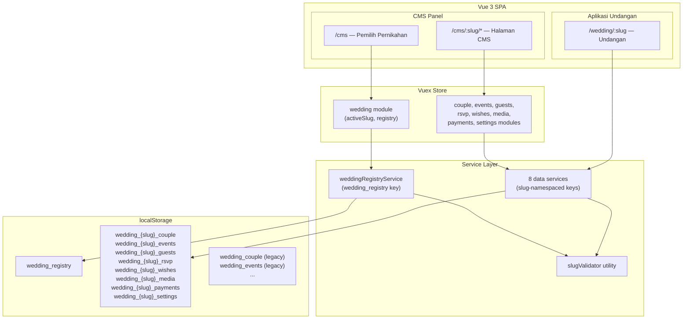
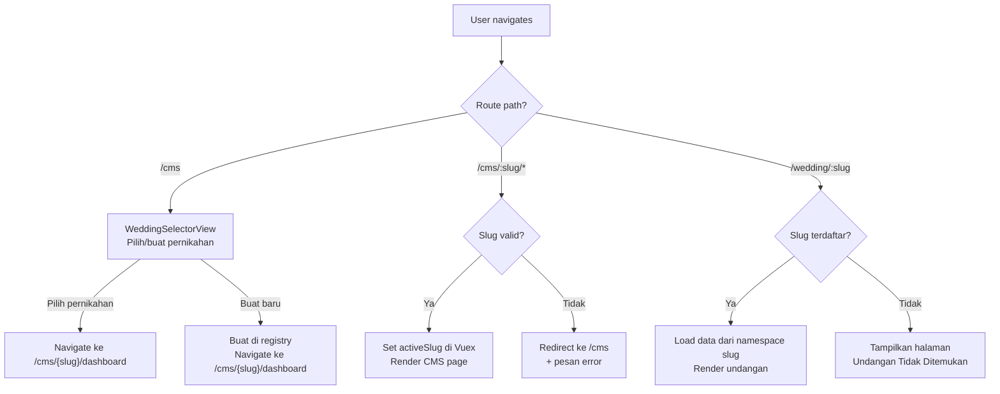
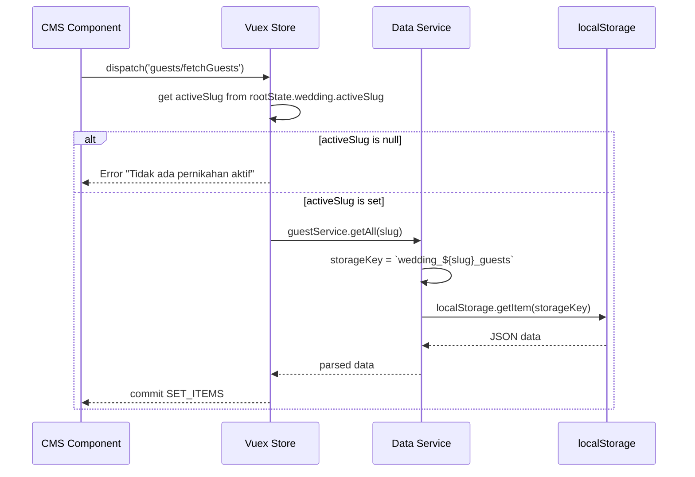
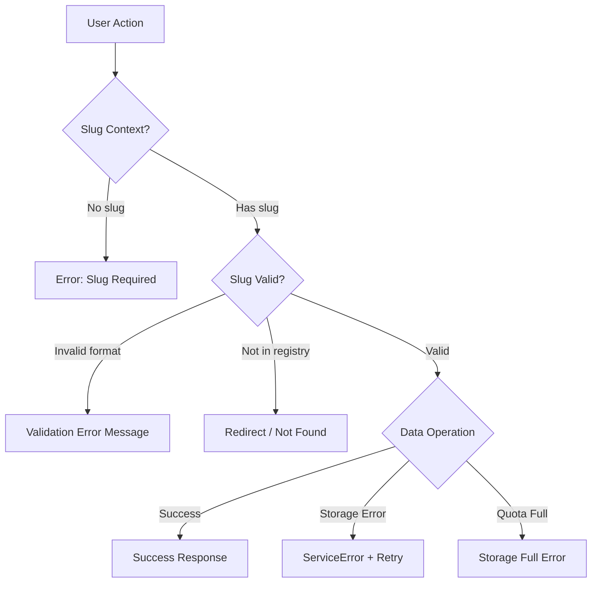

# Dokumen Desain: Multi-Tenant Wedding Support

## Overview

Fitur Multi-Tenant Wedding Support mengubah Wedding Invitation CMS dari sistem single-tenant (satu pernikahan) menjadi multi-tenant (banyak pernikahan) di mana setiap pernikahan memiliki slug unik dan data terisolasi di localStorage. Perubahan ini mencakup:

1. **Wedding Registry Service** — Service baru untuk mengelola daftar pernikahan (CRUD registri) dengan penyimpanan di `wedding_registry` localStorage key.
2. **Slug Validation Utility** — Modul validasi slug yang memastikan format kebab-case yang ketat (huruf kecil, angka, tanda hubung, 3-64 karakter).
3. **Service Layer Refactor** — Semua 8 service yang ada (couple, event, guest, rsvp, wish, media, payment, settings) direfaktor untuk menerima parameter `slug` dan menggunakan namespaced localStorage key `wedding_{slug}_{entity}`.
4. **Router Changes** — CMS routes berubah dari `/cms/{page}` menjadi `/cms/:slug/{page}`, dengan halaman pemilih pernikahan di `/cms`.
5. **Vuex Store Changes** — State global `activeSlug` ditambahkan, dan semua store module actions otomatis meneruskan slug ke service layer.
6. **CMS Components** — Komponen baru WeddingSelectorView dan perubahan sidebar untuk menampilkan konteks pernikahan aktif.
7. **InvitationView Changes** — Validasi slug terhadap registri sebelum memuat data undangan.
8. **Legacy Data Migration** — Utilitas untuk memigrasi data lama (tanpa prefix slug) ke format multi-tenant.

### Keputusan Desain Utama

| Keputusan              | Pilihan                                                                                             | Alasan                                                                                                                |
| ---------------------- | --------------------------------------------------------------------------------------------------- | --------------------------------------------------------------------------------------------------------------------- |
| Namespace Strategy     | `wedding_{slug}_{entity}` prefix di localStorage key                                                | Sederhana, mudah di-debug, dan memungkinkan isolasi data per pernikahan tanpa mengubah struktur data entity           |
| Slug Parameter Passing | Slug diteruskan dari Vuex store ke service layer secara otomatis via `rootState.wedding.activeSlug` | Menghindari perubahan di setiap komponen CMS — komponen tetap dispatch action tanpa slug, store yang menambahkan slug |
| Registry Storage       | Satu key `wedding_registry` berisi JSON array                                                       | Satu sumber kebenaran untuk daftar pernikahan, mudah di-query                                                         |
| Slug Validation        | Pure function di `src/utils/slugValidator.js`                                                       | Dapat digunakan di service layer, router guard, dan komponen form; mudah di-test dengan property-based testing        |
| Migration Approach     | One-time migration utility yang dipicu manual oleh admin                                            | Menghindari auto-migration yang bisa merusak data; admin memilih slug tujuan                                          |
| Router Guard           | `beforeEach` navigation guard untuk validasi slug                                                   | Satu titik validasi untuk semua CMS routes, redirect ke pemilih jika slug tidak valid                                 |

## Architecture

### Arsitektur Tingkat Tinggi (Multi-Tenant)



### Alur Routing (Multi-Tenant)



### Alur Data Service Layer (Refactored)



## Components and Interfaces

### File Baru

```
src/
├── api/
│   └── services/
│       └── weddingRegistryService.js    # NEW: Registry CRUD
├── cms/
│   └── views/
│       └── WeddingSelectorView.vue      # NEW: Pemilih pernikahan
├── store/
│   └── modules/
│       └── wedding.js                   # NEW: Wedding module (activeSlug, registry)
└── utils/
    ├── slugValidator.js                 # NEW: Slug validation utility
    └── legacyMigration.js               # NEW: Legacy data migration utility
```

### File yang Dimodifikasi

```
src/
├── api/services/
│   ├── coupleService.js                 # MODIFIED: tambah parameter slug
│   ├── eventService.js                  # MODIFIED: tambah parameter slug
│   ├── guestService.js                  # MODIFIED: tambah parameter slug
│   ├── rsvpService.js                   # MODIFIED: tambah parameter slug
│   ├── wishService.js                   # MODIFIED: tambah parameter slug
│   ├── mediaService.js                  # MODIFIED: tambah parameter slug
│   ├── paymentService.js                # MODIFIED: tambah parameter slug
│   └── settingsService.js              # MODIFIED: tambah parameter slug
├── cms/
│   ├── components/shared/
│   │   └── SidebarNav.vue               # MODIFIED: tampilkan konteks pernikahan aktif
│   └── layouts/
│       └── CmsLayout.vue                # MODIFIED: inject slug context
├── invitation/
│   └── views/
│       └── InvitationView.vue           # MODIFIED: validasi slug terhadap registry
├── router/
│   └── index.js                         # MODIFIED: CMS routes dengan :slug, guard
└── store/
    ├── index.js                         # MODIFIED: tambah wedding module
    └── modules/
        ├── couple.js                    # MODIFIED: pass slug ke service
        ├── events.js                    # MODIFIED: pass slug ke service
        ├── guests.js                    # MODIFIED: pass slug ke service
        ├── rsvp.js                      # MODIFIED: pass slug ke service
        ├── wishes.js                    # MODIFIED: pass slug ke service
        ├── media.js                     # MODIFIED: pass slug ke service
        ├── payments.js                  # MODIFIED: pass slug ke service
        └── settings.js                  # MODIFIED: pass slug ke service
```

### 1. Slug Validator Utility (`src/utils/slugValidator.js`)

```javascript
/**
 * Validates a wedding slug against the required format rules.
 *
 * Rules:
 * - Only lowercase letters (a-z), digits (0-9), and hyphens (-)
 * - Minimum 3 characters, maximum 64 characters
 * - Must not start or end with a hyphen
 * - Must not contain consecutive hyphens
 *
 * @param {string} slug - The slug to validate
 * @returns {{ valid: boolean, error: string | null }}
 */
export function validateSlug(slug) {
  /* ... */
}

/**
 * Normalizes input to a valid slug format.
 * Converts to lowercase, trims whitespace.
 *
 * @param {string} input - Raw input string
 * @returns {string} Normalized (lowercased, trimmed) string
 */
export function normalizeSlug(input) {
  /* ... */
}
```

### 2. Wedding Registry Service (`src/api/services/weddingRegistryService.js`)

```javascript
/**
 * @typedef {Object} WeddingEntry
 * @property {string} id - UUID
 * @property {string} slug - Unique kebab-case identifier
 * @property {string} label - Display name (e.g., "Pernikahan Budi & Ani")
 * @property {string} createdAt - ISO 8601 timestamp
 */

export const weddingRegistryService = {
  /** @returns {Promise<WeddingEntry[]>} */
  async getAll() {
    /* load from wedding_registry key */
  },

  /** @param {string} slug @returns {Promise<WeddingEntry|null>} */
  async getBySlug(slug) {
    /* find entry by slug */
  },

  /** @param {{ slug: string, label: string }} data @returns {Promise<WeddingEntry>} */
  async create(data) {
    // 1. Validate slug via slugValidator
    // 2. Check uniqueness against existing entries
    // 3. Add to registry array
    // 4. Save to localStorage
  },

  /** @param {string} slug @returns {Promise<boolean>} */
  async delete(slug) {
    // 1. Remove from registry array
    // 2. Remove all namespaced keys: wedding_{slug}_*
    // 3. Save updated registry
  },

  /** @param {string} slug @returns {boolean} */
  exists(slug) {
    /* synchronous check against registry */
  },
};
```

### 3. Service Layer Refactor Pattern

Setiap service direfaktor dengan pola yang sama. Contoh untuk `coupleService`:

**Sebelum (single-tenant):**

```javascript
const STORAGE_KEY = "wedding_couple";

function loadCouple() {
  const stored = localStorage.getItem(STORAGE_KEY);
  return stored ? JSON.parse(stored) : { ...coupleData };
}
```

**Sesudah (multi-tenant):**

```javascript
function getStorageKey(slug) {
  if (!slug)
    throw new ServiceError(
      "Slug pernikahan wajib disediakan",
      "SLUG_REQUIRED",
      false,
    );
  return `wedding_${slug}_couple`;
}

function loadCouple(slug) {
  const stored = localStorage.getItem(getStorageKey(slug));
  return stored ? JSON.parse(stored) : { ...coupleData };
}

export const coupleService = {
  async get(slug) {
    return loadCouple(slug);
  },
  async save(slug, data) {
    const serialized = JSON.stringify(data);
    localStorage.setItem(getStorageKey(slug), serialized);
    return JSON.parse(serialized);
  },
};
```

Pola ini diterapkan ke semua 8 service:

| Service           | Storage Key Pattern       | Perubahan Method Signature                                                                                                                                                                                   |
| ----------------- | ------------------------- | ------------------------------------------------------------------------------------------------------------------------------------------------------------------------------------------------------------ |
| `coupleService`   | `wedding_{slug}_couple`   | `get(slug)`, `save(slug, data)`                                                                                                                                                                              |
| `eventService`    | `wedding_{slug}_events`   | `getAll(slug)`, `getById(slug, id)`, `create(slug, data)`, `update(slug, id, data)`, `delete(slug, id)`                                                                                                      |
| `guestService`    | `wedding_{slug}_guests`   | `getAll(slug)`, `getById(slug, id)`, `create(slug, data)`, `update(slug, id, data)`, `delete(slug, id)`, `search(slug, query)`, `importFromExcel(slug, file)`, `exportToExcel(slug)`                         |
| `rsvpService`     | `wedding_{slug}_rsvp`     | `getAll(slug)`, `getById(slug, id)`, `create(slug, data)`, `update(slug, id, data)`, `delete(slug, id)`, `getByGuestId(slug, guestId)`, `getSummary(slug)`                                                   |
| `wishService`     | `wedding_{slug}_wishes`   | `getAll(slug)`, `getById(slug, id)`, `create(slug, data)`, `update(slug, id, data)`, `delete(slug, id)`, `getByStatus(slug, status)`, `updateStatus(slug, id, status)`                                       |
| `mediaService`    | `wedding_{slug}_media`    | `getAll(slug)`, `getById(slug, id)`, `create(slug, data)`, `update(slug, id, data)`, `delete(slug, id)`, `bulkDelete(slug, ids)`, `reorder(slug, orderedItems)`                                              |
| `paymentService`  | `wedding_{slug}_payments` | `getBankAccounts(slug)`, `addBankAccount(slug, data)`, `updateBankAccount(slug, id, data)`, `deleteBankAccount(slug, id)`, `getGifts(slug)`, `addGift(slug, data)`, `deleteGift(slug, id)`, `getTotal(slug)` |
| `settingsService` | `wedding_{slug}_settings` | `get(slug)`, `save(slug, data)`                                                                                                                                                                              |

### 4. Vuex Store Changes

#### Wedding Module (`src/store/modules/wedding.js`)

```javascript
export default {
  namespaced: true,

  state: () => ({
    activeSlug: null, // slug pernikahan yang sedang dikelola
    registry: [], // daftar WeddingEntry dari registry
    loading: false,
    error: null,
  }),

  mutations: {
    SET_ACTIVE_SLUG(state, slug) {
      state.activeSlug = slug;
    },
    SET_REGISTRY(state, registry) {
      state.registry = registry;
    },
    SET_LOADING(state, loading) {
      state.loading = loading;
    },
    SET_ERROR(state, error) {
      state.error = error;
    },
  },

  actions: {
    async fetchRegistry({ commit }) {
      /* load from weddingRegistryService */
    },
    async setActiveWedding({ commit, dispatch }, slug) {
      // 1. Validate slug exists in registry
      // 2. SET_ACTIVE_SLUG
      // 3. dispatch resetAllModules to clear stale data
    },
    async createWedding({ commit, dispatch }, { slug, label }) {
      /* ... */
    },
    async deleteWedding({ commit, dispatch }, slug) {
      /* ... */
    },
    resetAllModules({ commit }) {
      // Reset all data module states to initial values
    },
  },

  getters: {
    activeSlug: (state) => state.activeSlug,
    registry: (state) => state.registry,
    activeWedding: (state) =>
      state.registry.find((w) => w.slug === state.activeSlug),
  },
};
```

#### Data Module Refactor Pattern

Setiap data module (couple, events, guests, dll.) diubah agar mengambil slug dari `rootState`:

```javascript
// Contoh: store/modules/couple.js (refactored)
actions: {
  async fetchCouple({ commit, rootState }) {
    const slug = rootState.wedding.activeSlug
    if (!slug) {
      commit('SET_ERROR', 'Tidak ada pernikahan aktif')
      return
    }
    commit('SET_LOADING', true)
    try {
      const data = await coupleService.get(slug)
      commit('SET_DATA', data)
    } catch (error) {
      commit('SET_ERROR', error.message)
    } finally {
      commit('SET_LOADING', false)
    }
  },

  async saveCouple({ commit, rootState }, data) {
    const slug = rootState.wedding.activeSlug
    if (!slug) throw new Error('Tidak ada pernikahan aktif')
    // ... rest of save logic with slug
  }
}
```

Tambahan mutation `RESET` di setiap data module:

```javascript
mutations: {
  // ... existing mutations
  RESET(state) {
    state.data = null    // atau state.items = []
    state.loading = false
    state.error = null
  }
}
```

### 5. Router Changes (`src/router/index.js`)

```javascript
const routes = [
  {
    path: "/",
    redirect: "/cms",
  },
  // Wedding Selector (no slug required)
  {
    path: "/cms",
    name: "cms-selector",
    component: () => import("../cms/views/WeddingSelectorView.vue"),
  },
  // CMS with slug context
  {
    path: "/cms/:slug",
    component: CmsLayout,
    redirect: (to) => `/cms/${to.params.slug}/dashboard`,
    children: [
      {
        path: "dashboard",
        name: "cms-dashboard",
        component: () => import("../cms/views/DashboardView.vue"),
      },
      {
        path: "couple",
        name: "cms-couple",
        component: () => import("../cms/views/CoupleView.vue"),
      },
      {
        path: "events",
        name: "cms-events",
        component: () => import("../cms/views/EventsView.vue"),
      },
      {
        path: "template",
        name: "cms-template",
        component: () => import("../cms/views/TemplateView.vue"),
      },
      {
        path: "guests",
        name: "cms-guests",
        component: () => import("../cms/views/GuestsView.vue"),
      },
      {
        path: "checkin",
        name: "cms-checkin",
        component: () => import("../cms/views/CheckInView.vue"),
      },
      {
        path: "media",
        name: "cms-media",
        component: () => import("../cms/views/MediaView.vue"),
      },
      {
        path: "payment",
        name: "cms-payment",
        component: () => import("../cms/views/PaymentView.vue"),
      },
      {
        path: "rsvp",
        name: "cms-rsvp",
        component: () => import("../cms/views/RsvpView.vue"),
      },
      {
        path: "settings",
        name: "cms-settings",
        component: () => import("../cms/views/SettingsView.vue"),
      },
    ],
  },
  // Invitation (unchanged path, but now validates slug against registry)
  {
    path: "/wedding/:slug",
    component: InvitationLayout,
    children: [
      {
        path: "",
        name: "invitation",
        component: () => import("../invitation/views/InvitationView.vue"),
      },
    ],
  },
];

// Navigation guard for CMS slug validation
router.beforeEach(async (to, from, next) => {
  if (to.params.slug && to.path.startsWith("/cms/")) {
    const registry = weddingRegistryService;
    const exists = registry.exists(to.params.slug);
    if (!exists) {
      return next({ name: "cms-selector", query: { error: "not-found" } });
    }
    // Set active slug in store if changed
    const store = useStore();
    if (store.state.wedding.activeSlug !== to.params.slug) {
      await store.dispatch("wedding/setActiveWedding", to.params.slug);
    }
  }
  next();
});
```

### 6. SidebarNav Changes

Perubahan pada `SidebarNav.vue`:

- Menampilkan nama dan slug pernikahan aktif di header sidebar
- Menambahkan tombol "Ganti Pernikahan" yang mengarah ke `/cms` (WeddingSelectorView)
- Route links menggunakan `{ name: item.routeName, params: { slug: activeSlug } }`

```javascript
// Di SidebarNav.vue
const store = useStore();
const activeWedding = computed(() => store.getters["wedding/activeWedding"]);
const activeSlug = computed(() => store.getters["wedding/activeSlug"]);

// Menu items route links sekarang include slug param
// :to="{ name: item.routeName, params: { slug: activeSlug } }"
```

### 7. WeddingSelectorView (`src/cms/views/WeddingSelectorView.vue`)

Komponen ini menampilkan:

- Daftar pernikahan yang terdaftar (cards dengan nama, slug, tanggal)
- Formulir buat pernikahan baru (input: label, slug)
- Validasi slug real-time menggunakan `slugValidator`
- Tombol hapus per pernikahan dengan `ConfirmDialog`
- Deteksi data legacy dan tombol migrasi
- Pesan error jika diarahkan dari slug yang tidak valid

### 8. InvitationView Changes

```javascript
// Di InvitationView.vue — tambahan validasi slug
import { weddingRegistryService } from "@/api/services/weddingRegistryService.js";

async function loadData() {
  loading.value = true;
  error.value = null;

  // Validasi slug terhadap registry
  const slugExists = weddingRegistryService.exists(slug.value);
  if (!slugExists) {
    error.value =
      "Undangan tidak ditemukan. Pastikan URL yang Anda akses sudah benar.";
    loading.value = false;
    return;
  }

  // Load data dari namespace slug
  const [coupleData, eventsData, settingsData, mediaData] = await Promise.all([
    coupleService.get(slug.value),
    eventService.getAll(slug.value),
    settingsService.get(slug.value),
    mediaService.getAll(slug.value),
  ]);
  // ... rest of load logic
}
```

### 9. Legacy Migration Utility (`src/utils/legacyMigration.js`)

```javascript
/**
 * Detects if legacy (non-namespaced) wedding data exists in localStorage.
 * @returns {boolean}
 */
export function hasLegacyData() {
  /* ... */
}

/**
 * Migrates legacy data to a new slug namespace.
 * @param {string} slug - Target slug for the migrated data
 * @returns {Promise<{ success: boolean, migratedEntities: string[], error?: string }>}
 */
export async function migrateLegacyData(slug) {
  // 1. Validate slug
  // 2. For each entity key (wedding_couple, wedding_events, etc.):
  //    a. Read from old key
  //    b. Write to new key wedding_{slug}_{entity}
  // 3. Add entry to wedding_registry
  // 4. Remove old keys
  // If any step fails, rollback: remove new keys, keep old keys
}

/**
 * Legacy key names (without slug prefix).
 */
const LEGACY_KEYS = [
  "wedding_couple",
  "wedding_events",
  "wedding_guests",
  "wedding_rsvp",
  "wedding_wishes",
  "wedding_media",
  "wedding_payments",
  "wedding_settings",
];
```

## Data Models

### Wedding Registry Entry

```json
{
  "id": "uuid",
  "slug": "budi-ani",
  "label": "Pernikahan Budi & Ani",
  "createdAt": "2024-01-01T00:00:00Z"
}
```

Registry disimpan sebagai JSON array di localStorage key `wedding_registry`:

```json
[
  {
    "id": "uuid-1",
    "slug": "budi-ani",
    "label": "Pernikahan Budi & Ani",
    "createdAt": "2024-01-01T00:00:00Z"
  },
  {
    "id": "uuid-2",
    "slug": "dian-reza",
    "label": "Pernikahan Dian & Reza",
    "createdAt": "2024-02-15T00:00:00Z"
  }
]
```

### Namespace Key Mapping

| Entity   | Legacy Key         | Multi-Tenant Key          |
| -------- | ------------------ | ------------------------- |
| Couple   | `wedding_couple`   | `wedding_{slug}_couple`   |
| Events   | `wedding_events`   | `wedding_{slug}_events`   |
| Guests   | `wedding_guests`   | `wedding_{slug}_guests`   |
| RSVP     | `wedding_rsvp`     | `wedding_{slug}_rsvp`     |
| Wishes   | `wedding_wishes`   | `wedding_{slug}_wishes`   |
| Media    | `wedding_media`    | `wedding_{slug}_media`    |
| Payments | `wedding_payments` | `wedding_{slug}_payments` |
| Settings | `wedding_settings` | `wedding_{slug}_settings` |
| Registry | —                  | `wedding_registry`        |

### Entity Data Models

Semua entity data models (Couple, Event, Guest, RSVP, Wish, Media, Payment, Settings) tetap sama seperti di desain sebelumnya. Tidak ada perubahan pada struktur data entity — hanya key penyimpanan yang berubah.

## Correctness Properties

_A property is a characteristic or behavior that should hold true across all valid executions of a system — essentially, a formal statement about what the system should do. Properties serve as the bridge between human-readable specifications and machine-verifiable correctness guarantees._

### Property 1: Slug Validation Correctness

_For any_ string input, the slug validator SHALL accept it if and only if it consists solely of lowercase letters (a-z), digits (0-9), and hyphens (-), has length between 3 and 64 characters, does not start or end with a hyphen, and does not contain consecutive hyphens. Additionally, _for any_ string containing uppercase letters, `normalizeSlug` SHALL produce a string that is entirely lowercase.

**Validates: Requirements 2.1, 2.2, 2.3, 2.4**

### Property 2: Registry Serialization Round-Trip

_For any_ valid array of WeddingEntry objects (each with id, slug, label, createdAt) and _for any_ valid entity data object stored under a slug namespace, serializing to JSON then deserializing back SHALL produce an object deeply equal to the original.

**Validates: Requirements 1.6, 3.7**

### Property 3: Registry Create Produces Valid Unique Entries

_For any_ sequence of wedding creation requests with valid slugs and labels, each successfully created entry SHALL contain a non-empty id, the requested slug, the requested label, and a valid createdAt timestamp. Furthermore, the registry SHALL never contain two entries with the same slug — duplicate slug creation attempts SHALL be rejected.

**Validates: Requirements 1.2, 1.3, 1.4**

### Property 4: Data Isolation Across Slugs

_For any_ two distinct valid slugs A and B, and _for any_ entity type (couple, events, guests, rsvp, wishes, media, payments, settings), writing data to slug A's namespace SHALL NOT modify data readable from slug B's namespace. Reading from slug A SHALL return only data previously written to slug A's namespace.

**Validates: Requirements 3.2, 3.3, 3.6, 6.3**

### Property 5: Missing Slug Rejection

_For any_ service layer method or Vuex store data action called without a slug (undefined, null, or empty string), the system SHALL throw an error with a message indicating that a wedding slug is required, and no data SHALL be written to localStorage.

**Validates: Requirements 3.5, 8.4**

### Property 6: Slug Existence Validation

_For any_ slug string, the system SHALL allow access to CMS pages and load invitation data if and only if that slug exists in the wedding registry. _For any_ slug not present in the registry, CMS navigation SHALL redirect to the wedding selector and the invitation page SHALL display an error without loading any wedding data.

**Validates: Requirements 4.3, 4.4, 6.1, 6.2**

### Property 7: Wedding Deletion Removes All Namespaced Data

_For any_ wedding registered with slug S that has data stored across all entity namespaces, deleting wedding S from the registry SHALL remove the registry entry AND remove all localStorage keys matching the pattern `wedding_{S}_*`. After deletion, reading any entity for slug S SHALL return default/empty data.

**Validates: Requirements 1.5**

### Property 8: Legacy Migration Data Preservation

_For any_ set of legacy data stored under old keys (wedding*couple, wedding_events, etc.) and *for any* valid target slug, migrating the legacy data SHALL produce data at the new namespaced keys (`wedding*{slug}\_{entity}`) that is deeply equal to the original legacy data. After successful migration, the old legacy keys SHALL no longer exist in localStorage.

**Validates: Requirements 7.2, 7.3, 7.5**

### Property 9: Store State Reset on Slug Change

_For any_ two distinct slugs A and B with different data stored in their namespaces, switching the active slug from A to B in the Vuex store SHALL result in all data modules (couple, events, guests, rsvp, wishes, media, payments, settings) being reset and reloaded with data from slug B's namespace, with no residual data from slug A.

**Validates: Requirements 8.2**

## Error Handling

### Strategi Error Handling

Sistem menggunakan pendekatan error handling berlapis yang konsisten dengan desain CMS sebelumnya, dengan penambahan error handling untuk konteks multi-tenant:



### Error Types

| Konteks                             | Error Code                      | Pesan                                                                                   | Retryable |
| ----------------------------------- | ------------------------------- | --------------------------------------------------------------------------------------- | --------- |
| Slug tidak disediakan               | `SLUG_REQUIRED`                 | "Slug pernikahan wajib disediakan"                                                      | No        |
| Format slug tidak valid             | `INVALID_SLUG`                  | "Format slug tidak valid. Gunakan huruf kecil, angka, dan tanda hubung (3-64 karakter)" | No        |
| Slug sudah digunakan                | `SLUG_DUPLICATE`                | "Slug sudah digunakan oleh pernikahan lain"                                             | No        |
| Slug tidak ditemukan di registry    | `WEDDING_NOT_FOUND`             | "Pernikahan tidak ditemukan"                                                            | No        |
| Tidak ada pernikahan aktif di store | `NO_ACTIVE_WEDDING`             | "Tidak ada pernikahan aktif. Pilih pernikahan terlebih dahulu."                         | No        |
| localStorage penuh                  | `STORAGE_FULL`                  | "Penyimpanan penuh. Hapus data lama untuk melanjutkan."                                 | No        |
| Gagal load/save data                | `*_LOAD_ERROR` / `*_SAVE_ERROR` | Pesan spesifik per entity                                                               | Yes       |
| Migrasi gagal                       | `MIGRATION_ERROR`               | "Migrasi data gagal. Data lama tidak diubah."                                           | Yes       |

### Migration Error Handling

Migrasi legacy data menggunakan strategi rollback:

1. **Pre-check**: Validasi slug tujuan sebelum mulai migrasi
2. **Atomic-ish copy**: Salin semua entity ke key baru satu per satu
3. **Rollback on failure**: Jika ada entity yang gagal disalin (misal quota penuh), hapus semua key baru yang sudah dibuat dan pertahankan key lama
4. **Cleanup on success**: Hapus key lama hanya setelah semua entity berhasil disalin

```javascript
// Pseudocode migration rollback
const copiedKeys = [];
try {
  for (const entity of ENTITIES) {
    const oldData = localStorage.getItem(`wedding_${entity}`);
    if (oldData) {
      const newKey = `wedding_${slug}_${entity}`;
      localStorage.setItem(newKey, oldData);
      copiedKeys.push(newKey);
    }
  }
  // Success — remove old keys
  for (const entity of ENTITIES) {
    localStorage.removeItem(`wedding_${entity}`);
  }
} catch (error) {
  // Rollback — remove new keys
  for (const key of copiedKeys) {
    localStorage.removeItem(key);
  }
  throw new ServiceError(
    "Migrasi data gagal. Data lama tidak diubah.",
    "MIGRATION_ERROR",
    true,
  );
}
```

## Testing Strategy

### Testing Framework

- **Unit & Property Tests**: Vitest + fast-check (sudah ada di project)
- **Component Tests**: @vue/test-utils + jsdom (sudah ada di project)
- **Test Environment**: jsdom (sudah dikonfigurasi di vitest.config.js)

### Dual Testing Approach

#### Property-Based Tests (fast-check)

Property-based testing sangat cocok untuk fitur ini karena:

- Slug validation adalah pure function dengan input space yang besar (semua string)
- Data isolation adalah universal property yang harus berlaku untuk semua kombinasi slug
- Round-trip serialization harus berlaku untuk semua valid data
- Migration harus mempertahankan data untuk semua entity types

**Konfigurasi**:

- Minimum 100 iterasi per property test
- Setiap test di-tag dengan referensi ke property di design document
- Format tag: `Feature: multi-tenant-wedding, Property {number}: {property_text}`

**Property tests yang akan diimplementasi**:

| Property   | File Test                                                  | Deskripsi                                                                   |
| ---------- | ---------------------------------------------------------- | --------------------------------------------------------------------------- |
| Property 1 | `tests/utils/slugValidator.property.test.js`               | Slug validation accepts/rejects correctly, normalization produces lowercase |
| Property 2 | `tests/api/services/weddingRegistry.property.test.js`      | Registry and entity data JSON round-trip                                    |
| Property 3 | `tests/api/services/weddingRegistry.property.test.js`      | Create produces valid entries, uniqueness enforced                          |
| Property 4 | `tests/api/services/multiTenantIsolation.property.test.js` | Cross-slug data isolation for all entity types                              |
| Property 5 | `tests/api/services/multiTenantIsolation.property.test.js` | Missing slug throws error                                                   |
| Property 6 | `tests/api/services/weddingRegistry.property.test.js`      | Slug existence check correctness                                            |
| Property 7 | `tests/api/services/weddingRegistry.property.test.js`      | Deletion removes all namespaced keys                                        |
| Property 8 | `tests/utils/legacyMigration.property.test.js`             | Migration preserves data, removes old keys                                  |
| Property 9 | `tests/store/wedding.property.test.js`                     | State reset on slug change                                                  |

#### Unit Tests (Example-Based)

Unit tests untuk skenario spesifik, edge cases, dan integrasi komponen:

| Area                        | File Test                                           | Skenario                                              |
| --------------------------- | --------------------------------------------------- | ----------------------------------------------------- |
| Slug Validator              | `tests/utils/slugValidator.test.js`                 | Specific valid/invalid slug examples, error messages  |
| Wedding Registry Service    | `tests/api/services/weddingRegistryService.test.js` | CRUD operations, duplicate handling                   |
| Service Layer (per service) | `tests/api/services/{service}.test.js`              | Existing tests updated to pass slug parameter         |
| Router Guard                | `tests/router/slugGuard.test.js`                    | Navigation guard redirect behavior                    |
| WeddingSelectorView         | `tests/cms/views/WeddingSelectorView.test.js`       | Render, create, select, delete interactions           |
| SidebarNav                  | `tests/cms/components/SidebarNav.test.js`           | Active wedding display, switch link                   |
| InvitationView              | `tests/invitation/views/InvitationView.test.js`     | Slug validation, error display                        |
| Legacy Migration            | `tests/utils/legacyMigration.test.js`               | Detection, migration, rollback on failure             |
| Vuex Wedding Module         | `tests/store/wedding.test.js`                       | setActiveWedding, resetAllModules, null slug handling |

### Test Generators (fast-check Arbitraries)

Untuk property tests, diperlukan custom generators:

```javascript
// Arbitrary untuk valid slug
const validSlugArb = fc
  .stringOf(
    fc.constantFrom(..."abcdefghijklmnopqrstuvwxyz0123456789-".split("")),
    { minLength: 3, maxLength: 64 },
  )
  .filter((s) => !s.startsWith("-") && !s.endsWith("-") && !s.includes("--"));

// Arbitrary untuk WeddingEntry
const weddingEntryArb = fc.record({
  id: fc.uuid(),
  slug: validSlugArb,
  label: fc.string({ minLength: 1, maxLength: 100 }),
  createdAt: fc.date().map((d) => d.toISOString()),
});

// Arbitrary untuk entity data (couple, guest, etc.)
const coupleDataArb = fc.record({
  groom: fc.record({
    fullName: fc.string({ minLength: 1 }),
    nickname: fc.string(),
  }),
  bride: fc.record({
    fullName: fc.string({ minLength: 1 }),
    nickname: fc.string(),
  }),
});
```

### Coverage Goals

- Utility functions (slugValidator, legacyMigration): >90% line coverage
- Service layer (all 8 services + registry): >85% line coverage
- Vuex wedding module: >85% line coverage
- Component tests: key user interactions covered
