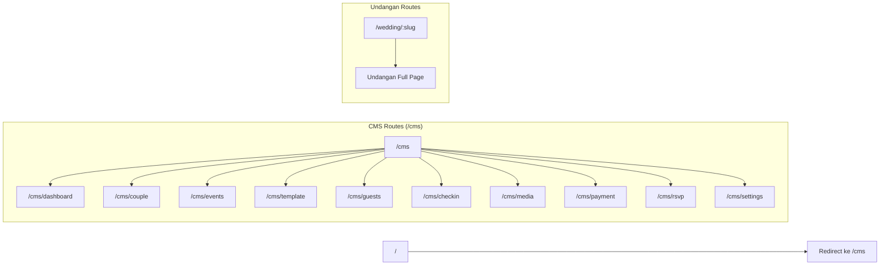
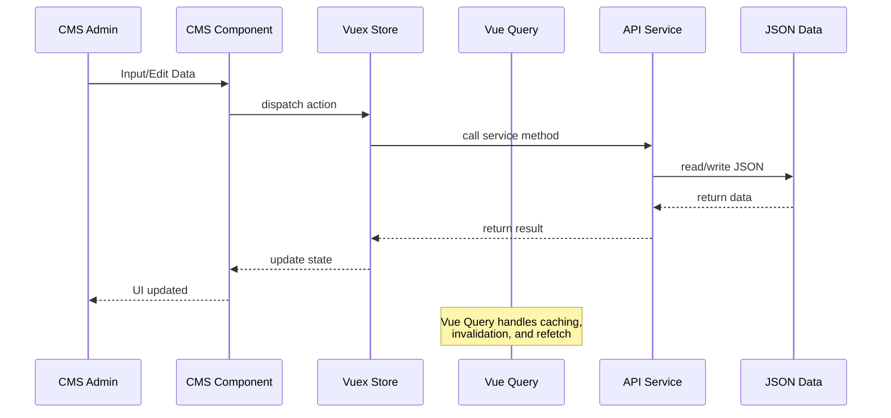
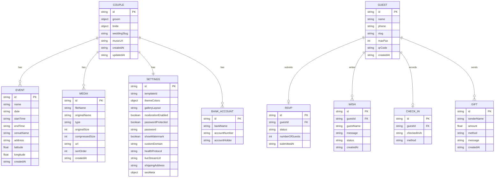
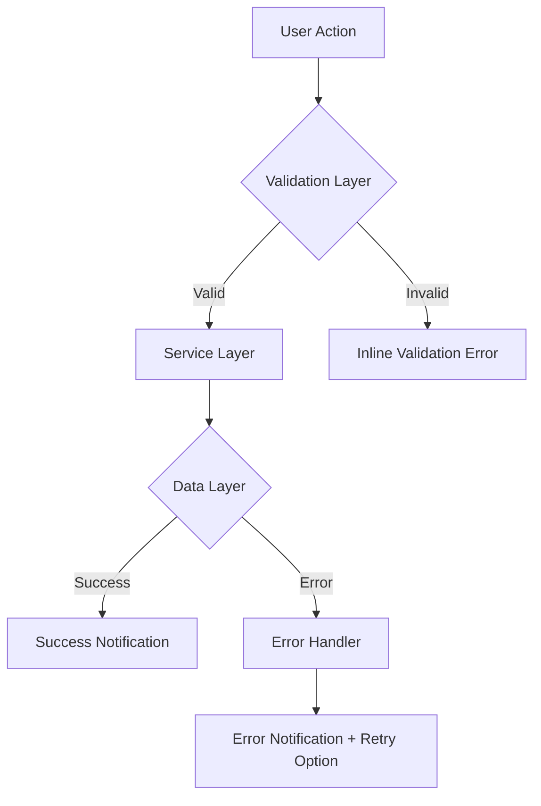

# Dokumen Desain: Wedding Invitation CMS

## Overview

Wedding Invitation CMS adalah sistem manajemen konten untuk undangan pernikahan online yang terdiri dari dua aplikasi utama dalam satu proyek Vue 3:

1. **CMS Panel** — Antarmuka admin untuk mengelola seluruh data pernikahan (mempelai, acara, tamu, media, pembayaran, RSVP) dengan navigasi sidebar SPA.
2. **Aplikasi Undangan** — Halaman guest-facing yang merender undangan berdasarkan template yang dipilih, menampilkan countdown, galeri, RSVP, buku tamu, dan amplop digital.

Seluruh data disimpan secara lokal menggunakan JSON files dan localStorage browser, dengan arsitektur service layer di folder `api/` yang mengabstraksi akses data sehingga migrasi ke database backend dapat dilakukan dengan mengganti implementasi service tanpa mengubah komponen UI.

### Keputusan Desain Utama

| Keputusan          | Pilihan                                             | Alasan                                                                                    |
| ------------------ | --------------------------------------------------- | ----------------------------------------------------------------------------------------- |
| State Management   | Vuex + TanStack Vue Query                           | Vuex untuk state global CMS, Vue Query untuk caching dan sinkronisasi data dari API layer |
| Routing            | Vue Router dengan nested routes                     | CMS dan Undangan sebagai route group terpisah dalam satu SPA                              |
| Penyimpanan        | JSON files di `api/data/` + localStorage            | Sesuai requirement, siap migrasi ke REST API/database                                     |
| Image Optimization | browser-image-compression + canvas WebP             | Kompresi client-side tanpa backend                                                        |
| Template Engine    | Dynamic component loading via Vue `<component :is>` | Pergantian template tanpa kehilangan data                                                 |
| Animasi            | AOS (Animate on Scroll)                             | Sudah ada di dependencies, smooth scroll-triggered animations                             |
| QR Code            | qrcode.vue (generate) + vue-qrcode-reader (scan)    | Sudah ada di dependencies                                                                 |
| PDF/Image Export   | jspdf + html-to-image                               | Sudah ada di dependencies                                                                 |
| i18n               | vue-i18n                                            | Sudah ada di dependencies, bahasa Indonesia sebagai default                               |

## Architecture

### Arsitektur Tingkat Tinggi

```mermaid
graph TB
    subgraph "Vue 3 SPA"
        subgraph "CMS Panel (/cms/*)"
            Dashboard[Dashboard]
            DataPernikahan[Data Pernikahan]
            TemplatePreview[Template & Preview]
            DaftarTamu[Daftar Tamu]
            Media[Media]
            Pembayaran[Pembayaran & Hadiah]
            RSVPUcapan[RSVP & Ucapan]
            Pengaturan[Pengaturan]
        end

        subgraph "Aplikasi Undangan (/wedding/:slug)"
            Cover[Cover / Pembuka]
            Mempelai[Profil Mempelai]
            Acara[Info Acara & Peta]
            Countdown[Countdown Timer]
            Gallery[Galeri Foto/Video]
            RSVPForm[Formulir RSVP]
            BukuTamu[Buku Tamu]
            AmplopDigital[Amplop Digital]
        end
    end

    subgraph "Service Layer (api/services/)"
        CoupleService[coupleService]
        EventService[eventService]
        GuestService[guestService]
        RSVPService[rsvpService]
        MediaService[mediaService]
        PaymentService[paymentService]
        WishService[wishService]
        SettingsService[settingsService]
    end

    subgraph "Data Layer (api/data/)"
        CoupleJSON[couple.json]
        EventsJSON[events.json]
        GuestsJSON[guests.json]
        RSVPJSON[rsvp.json]
        MediaJSON[media.json]
        PaymentsJSON[payments.json]
        WishesJSON[wishes.json]
        SettingsJSON[settings.json]
    end

    CMS Panel --> Service Layer
    Aplikasi Undangan --> Service Layer
    Service Layer --> Data Layer
```

### Arsitektur Routing



### Alur Data



## Components and Interfaces

### Struktur Folder Proyek

```
src/
├── api/
│   ├── data/                    # JSON data files
│   │   ├── couple.json
│   │   ├── events.json
│   │   ├── guests.json
│   │   ├── rsvp.json
│   │   ├── wishes.json
│   │   ├── media.json
│   │   ├── payments.json
│   │   └── settings.json
│   ├── services/                # Service layer (abstraksi CRUD)
│   │   ├── coupleService.js
│   │   ├── eventService.js
│   │   ├── guestService.js
│   │   ├── rsvpService.js
│   │   ├── wishService.js
│   │   ├── mediaService.js
│   │   ├── paymentService.js
│   │   └── settingsService.js
│   └── schemas/                 # JSON schema definitions
│       ├── coupleSchema.js
│       ├── eventSchema.js
│       ├── guestSchema.js
│       └── ...
├── cms/
│   ├── layouts/
│   │   └── CmsLayout.vue        # Sidebar + main content layout
│   ├── views/
│   │   ├── DashboardView.vue
│   │   ├── CoupleView.vue
│   │   ├── EventsView.vue
│   │   ├── TemplateView.vue
│   │   ├── GuestsView.vue
│   │   ├── CheckInView.vue
│   │   ├── MediaView.vue
│   │   ├── PaymentView.vue
│   │   ├── RsvpView.vue
│   │   └── SettingsView.vue
│   └── components/
│       ├── dashboard/
│       │   ├── StatCard.vue
│       │   ├── VisitorChart.vue
│       │   ├── RsvpSummary.vue
│       │   └── ActivityLog.vue
│       ├── couple/
│       │   ├── CoupleForm.vue
│       │   └── PhotoUploader.vue
│       ├── events/
│       │   ├── EventForm.vue
│       │   └── MapPreview.vue
│       ├── template/
│       │   ├── TemplateGallery.vue
│       │   ├── TemplateCard.vue
│       │   ├── ThemeCustomizer.vue
│       │   └── LivePreview.vue
│       ├── guests/
│       │   ├── GuestTable.vue
│       │   ├── GuestForm.vue
│       │   ├── ImportExport.vue
│       │   ├── WhatsAppLinkGenerator.vue
│       │   └── QrCodeGenerator.vue
│       ├── media/
│       │   ├── MediaUploader.vue
│       │   ├── MediaGrid.vue
│       │   └── GalleryLayoutPicker.vue
│       ├── payment/
│       │   ├── BankAccountForm.vue
│       │   ├── QrisUploader.vue
│       │   └── GiftLog.vue
│       ├── rsvp/
│       │   ├── WishList.vue
│       │   ├── WishModerator.vue
│       │   └── RsvpExporter.vue
│       └── shared/
│           ├── SidebarNav.vue
│           ├── LoadingIndicator.vue
│           ├── ErrorMessage.vue
│           ├── ConfirmDialog.vue
│           ├── ColorPicker.vue
│           ├── AudioPlayer.vue
│           └── FileUploader.vue
├── invitation/
│   ├── layouts/
│   │   └── InvitationLayout.vue  # Full-page invitation wrapper
│   ├── views/
│   │   └── InvitationView.vue    # Main invitation page (loads template)
│   ├── sections/                  # Reusable invitation sections
│   │   ├── CoverSection.vue
│   │   ├── CoupleSection.vue
│   │   ├── EventSection.vue
│   │   ├── CountdownSection.vue
│   │   ├── GallerySection.vue
│   │   ├── RsvpSection.vue
│   │   ├── WishesSection.vue
│   │   ├── GiftSection.vue
│   │   ├── MusicPlayer.vue
│   │   └── PasswordGate.vue
│   ├── templates/                 # Template definitions
│   │   ├── index.js              # Template registry
│   │   ├── batik-elegance/
│   │   │   ├── BatikEleganceTemplate.vue
│   │   │   ├── styles.css
│   │   │   └── thumbnail.webp
│   │   ├── wayang-romance/
│   │   │   ├── WayangRomanceTemplate.vue
│   │   │   ├── styles.css
│   │   │   └── thumbnail.webp
│   │   └── songket-royal/
│   │       ├── SongketRoyalTemplate.vue
│   │       ├── styles.css
│   │       └── thumbnail.webp
│   └── composables/
│       ├── useCountdown.js
│       ├── useMusicPlayer.js
│       ├── useRsvpForm.js
│       └── useGuestName.js
├── composables/                   # Shared composables
│   ├── useImageOptimizer.js
│   ├── useWhatsAppLink.js
│   ├── useQrCode.js
│   ├── useCalendarExport.js
│   └── useClipboard.js
├── store/                         # Vuex store
│   ├── index.js
│   └── modules/
│       ├── couple.js
│       ├── events.js
│       ├── guests.js
│       ├── rsvp.js
│       ├── wishes.js
│       ├── media.js
│       ├── payments.js
│       ├── settings.js
│       └── template.js
├── router/
│   └── index.js
├── i18n/
│   ├── index.js
│   └── locales/
│       └── id.json               # Bahasa Indonesia (default)
├── utils/
│   ├── validators.js
│   ├── formatters.js
│   ├── urlEncoder.js
│   └── serializer.js
├── assets/
│   ├── images/
│   │   └── nusantara/            # Aset tema Nusantara
│   ├── fonts/
│   └── audio/
├── App.vue
└── main.js
```

### Komponen Utama dan Interface

#### 1. Service Layer Interface

Setiap service di `api/services/` mengimplementasikan interface CRUD yang konsisten:

```typescript
// Interface umum untuk semua service
interface DataService<T> {
  getAll(): Promise<T[]>;
  getById(id: string): Promise<T | null>;
  create(data: Omit<T, "id" | "createdAt" | "updatedAt">): Promise<T>;
  update(id: string, data: Partial<T>): Promise<T>;
  delete(id: string): Promise<boolean>;
}
```

Implementasi saat ini menggunakan JSON file + localStorage. Untuk migrasi ke database, cukup ganti implementasi service tanpa mengubah interface.

```javascript
// api/services/coupleService.js
import coupleData from "../data/couple.json";

const STORAGE_KEY = "wedding_couple";

export const coupleService = {
  async get() {
    const stored = localStorage.getItem(STORAGE_KEY);
    return stored ? JSON.parse(stored) : coupleData;
  },

  async save(data) {
    const serialized = JSON.stringify(data);
    localStorage.setItem(STORAGE_KEY, serialized);
    return JSON.parse(serialized); // round-trip untuk konsistensi
  },
};
```

#### 2. Template Engine Interface

```typescript
// Template registry interface
interface TemplateDefinition {
  id: string
  name: string
  description: string
  thumbnail: string
  component: () => Promise<Component>  // lazy-loaded Vue component
  defaultConfig: TemplateConfig
}

interface TemplateConfig {
  primaryColor: string
  secondaryColor: string
  accentColor: string
  fontFamily: string
  galleryLayout: 'masonry' | 'slider' | 'grid'
  animationStyle: string
}

// Template registry (invitation/templates/index.js)
const templates: TemplateDefinition[] = [
  {
    id: 'batik-elegance',
    name: 'Batik Elegance',
    description: 'Desain elegan dengan motif batik Jawa',
    thumbnail: '/templates/batik-elegance/thumbnail.webp',
    component: () => import('./batik-elegance/BatikEleganceTemplate.vue'),
    defaultConfig: { ... }
  },
  // ... more templates
]
```

#### 3. Image Optimizer Interface

```typescript
// composables/useImageOptimizer.js
interface ImageOptimizerOptions {
  maxSizeMB: number; // default: 0.5 (500KB)
  maxWidthOrHeight: number; // default: 1920
  outputFormat: "webp";
}

interface OptimizedImage {
  file: File;
  originalSize: number;
  compressedSize: number;
  url: string; // object URL for preview
}

function useImageOptimizer(): {
  optimize(
    file: File,
    options?: Partial<ImageOptimizerOptions>,
  ): Promise<OptimizedImage>;
  optimizeMultiple(files: File[]): Promise<OptimizedImage[]>;
};
```

#### 4. WhatsApp Link Generator Interface

```typescript
// composables/useWhatsAppLink.js
interface WhatsAppLinkOptions {
  domain: string;
  weddingSlug: string;
  messageTemplate: string;
}

function useWhatsAppLink(options: WhatsAppLinkOptions): {
  generateInvitationUrl(guestName: string): string;
  generateWhatsAppUrl(phoneNumber: string, guestName: string): string;
  generateBulkLinks(
    guests: Guest[],
  ): { guestId: string; invitationUrl: string; whatsappUrl: string }[];
};
```

#### 5. QR Code / Check-In Interface

```typescript
// composables/useQrCode.js
interface QrCodeData {
  guestId: string;
  weddingSlug: string;
  checksum: string;
}

function useQrCode(): {
  encode(data: QrCodeData): string;
  decode(qrString: string): QrCodeData | null;
};

// Sistem_Check_In di CMS
interface CheckInResult {
  success: boolean;
  guest: Guest | null;
  alreadyCheckedIn: boolean;
  message: string;
  timestamp: string;
}
```

#### 6. Countdown Composable Interface

```typescript
// invitation/composables/useCountdown.js
interface CountdownValues {
  days: Ref<number>;
  hours: Ref<number>;
  minutes: Ref<number>;
  seconds: Ref<number>;
  isExpired: Ref<boolean>;
}

function useCountdown(targetDate: string | Date): CountdownValues;
```

## Data Models

### Entity Relationship Diagram



### Skema Data Detail

#### Couple (Mempelai)

```json
{
  "id": "uuid",
  "weddingSlug": "budi-ani",
  "groom": {
    "fullName": "Budi Santoso",
    "nickname": "Budi",
    "photo": "media/groom.webp",
    "fatherName": "H. Santoso",
    "motherName": "Hj. Siti Aminah",
    "instagramUrl": "https://instagram.com/budi",
    "childOrder": "Putra pertama"
  },
  "bride": {
    "fullName": "Ani Rahayu",
    "nickname": "Ani",
    "photo": "media/bride.webp",
    "fatherName": "H. Rahayu",
    "motherName": "Hj. Dewi Sartika",
    "instagramUrl": "https://instagram.com/ani",
    "childOrder": "Putri kedua"
  },
  "musicUrl": "media/background-music.mp3",
  "createdAt": "2024-01-01T00:00:00Z",
  "updatedAt": "2024-01-01T00:00:00Z"
}
```

#### Event (Acara)

```json
{
  "id": "uuid",
  "name": "Akad Nikah",
  "date": "2024-12-25",
  "startTime": "08:00",
  "endTime": "10:00",
  "venueName": "Masjid Istiqlal",
  "address": "Jl. Taman Wijaya Kusuma, Jakarta Pusat",
  "latitude": -6.1702,
  "longitude": 106.831,
  "createdAt": "2024-01-01T00:00:00Z"
}
```

#### Guest (Tamu)

```json
{
  "id": "uuid",
  "name": "Bpk. Ahmad Fauzi",
  "phone": "628123456789",
  "slug": "bpk-ahmad-fauzi",
  "maxPax": 2,
  "qrCode": "encoded-qr-string",
  "invitationUrl": "/wedding/budi-ani?to=Bpk.+Ahmad+Fauzi",
  "createdAt": "2024-01-01T00:00:00Z"
}
```

#### RSVP

```json
{
  "id": "uuid",
  "guestId": "guest-uuid",
  "guestName": "Bpk. Ahmad Fauzi",
  "status": "Hadir",
  "numberOfGuests": 2,
  "submittedAt": "2024-01-15T10:30:00Z"
}
```

#### Wish (Ucapan)

```json
{
  "id": "uuid",
  "guestId": "guest-uuid",
  "guestName": "Ahmad Fauzi",
  "message": "Selamat menempuh hidup baru!",
  "status": "approved",
  "createdAt": "2024-01-15T10:31:00Z"
}
```

#### Media

```json
{
  "id": "uuid",
  "fileName": "prewedding-001.webp",
  "originalName": "IMG_2024.jpg",
  "type": "image",
  "originalSize": 2500000,
  "compressedSize": 450000,
  "url": "media/prewedding-001.webp",
  "thumbnailUrl": "media/thumb-prewedding-001.webp",
  "sortOrder": 1,
  "createdAt": "2024-01-01T00:00:00Z"
}
```

#### Bank Account (Rekening)

```json
{
  "id": "uuid",
  "bankName": "BCA",
  "accountNumber": "1234567890",
  "accountHolder": "Budi Santoso",
  "logoUrl": "assets/banks/bca.png"
}
```

#### Gift (Hadiah Digital)

```json
{
  "id": "uuid",
  "senderName": "Ahmad Fauzi",
  "amount": 500000,
  "method": "transfer_bank",
  "bankName": "BCA",
  "message": "Selamat ya!",
  "createdAt": "2024-01-15T11:00:00Z"
}
```

#### Settings (Pengaturan)

```json
{
  "id": "uuid",
  "templateId": "batik-elegance",
  "themeColors": {
    "primary": "#8B4513",
    "secondary": "#D2691E",
    "accent": "#FFD700"
  },
  "galleryLayout": "masonry",
  "moderationEnabled": true,
  "passwordProtected": false,
  "password": "",
  "showWatermark": true,
  "customDomain": "",
  "healthProtocol": "",
  "liveStreamUrl": "",
  "shippingAddress": "",
  "seoMeta": {
    "title": "Pernikahan Budi & Ani",
    "description": "Kami mengundang Anda untuk hadir di hari bahagia kami",
    "image": "media/og-image.webp"
  },
  "qrisImageUrl": "",
  "createdAt": "2024-01-01T00:00:00Z",
  "updatedAt": "2024-01-01T00:00:00Z"
}
```

### Serialisasi dan Validasi Data

Setiap entitas memiliki schema validator di `api/schemas/` yang mendefinisikan:

- Field yang wajib (required) dan opsional
- Tipe data dan format (string, number, enum)
- Constraint validasi (min/max length, range, pattern)

```javascript
// api/schemas/guestSchema.js
export const guestSchema = {
  required: ["name"],
  properties: {
    name: { type: "string", minLength: 1 },
    phone: { type: "string", pattern: /^[0-9+\-\s]+$/ },
    maxPax: { type: "number", min: 1, max: 10 },
  },
};

// utils/serializer.js
export function serialize(entity) {
  return JSON.stringify(entity);
}

export function deserialize(json) {
  return JSON.parse(json);
}

export function roundTrip(entity) {
  return deserialize(serialize(entity));
}
```

## Correctness Properties

_A property is a characteristic or behavior that should hold true across all valid executions of a system — essentially, a formal statement about what the system should do. Properties serve as the bridge between human-readable specifications and machine-verifiable correctness guarantees._

### Property 1: Serialization Round-Trip

_For any_ valid entity data object (Couple, Event, Guest, RSVP, Wish, Media, BankAccount, Gift, Settings), serializing to JSON then deserializing back SHALL produce an object that is deeply equal to the original.

**Validates: Requirements 2.5, 3.3, 18.5**

### Property 2: Guest Excel Export/Import Round-Trip

_For any_ valid guest list, exporting to Excel format then importing the resulting file back SHALL produce a guest list that is equivalent to the original (same names, phone numbers, RSVP statuses, and check-in data).

**Validates: Requirements 6.6**

### Property 3: URL Encoding Round-Trip for Guest Names

_For any_ guest name string (including spaces, special characters, and Unicode), encoding the name for use in a URL parameter then decoding it back SHALL produce the original guest name.

**Validates: Requirements 7.5**

### Property 4: Invitation URL Format Correctness

_For any_ guest with a name and phone number, and any wedding slug, the generated invitation URL SHALL match the format `{domain}/wedding/{slug}?to={encoded-name}` and the bulk generation SHALL produce a valid unique URL for every guest in the list.

**Validates: Requirements 7.1, 7.4**

### Property 5: WhatsApp URL Format Correctness

_For any_ guest with a phone number and any invitation message, the generated WhatsApp URL SHALL match the format `https://wa.me/{phone}?text={encoded-message}` with properly encoded components.

**Validates: Requirements 7.3**

### Property 6: Template Switch Preserves Data (Idempotence)

_For any_ wedding data state and any two templates A and B, switching from template A to template B and back to template A SHALL produce a rendering identical to the original template A state, and all underlying data (couple, events, guests, media) SHALL remain unchanged after any template switch.

**Validates: Requirements 5.2, 5.5**

### Property 7: QR Code Encode/Decode Round-Trip and Uniqueness

_For any_ guest, encoding their identification into a QR code string then decoding it back SHALL produce the original guest identification. Additionally, _for any_ two distinct guests, their generated QR codes SHALL be different.

**Validates: Requirements 8.1, 17.4**

### Property 8: Check-In Idempotence

_For any_ guest who has already been checked in, scanning their QR code again SHALL NOT modify the existing check-in record (timestamp and status remain identical to the first check-in).

**Validates: Requirements 8.5**

### Property 9: Save Idempotence

_For any_ valid entity data, saving it to the storage layer twice consecutively with the same data SHALL produce a state identical to saving it once.

**Validates: Requirements 18.6**

### Property 10: Service Layer CRUD Consistency

_For any_ valid entity, creating it through the service layer then reading it back SHALL return the same data. Updating a field then reading SHALL reflect the update. Deleting then reading SHALL return null.

**Validates: Requirements 6.2, 18.2**

### Property 11: Visitor Count Aggregation

_For any_ list of visit timestamps, grouping by day SHALL produce counts where the sum of all daily counts equals the total number of visits, and each visit is assigned to exactly one day bucket.

**Validates: Requirements 1.1**

### Property 12: RSVP Status Counting

_For any_ list of RSVP entries with statuses "Hadir", "Tidak Hadir", or "Mungkin", the summary counts SHALL sum to the total number of RSVP entries, and each entry SHALL be counted in exactly one status category.

**Validates: Requirements 1.2**

### Property 13: Wish Visibility Filtering

_For any_ list of wishes with mixed visibility statuses (approved, hidden, pending), the guest-facing wish list SHALL contain only wishes with "approved" status, displayed in chronological order (oldest first).

**Validates: Requirements 11.2, 14.3**

### Property 14: Wish Status Filter

_For any_ list of wishes and any filter value ("all", "approved", "hidden", "pending"), applying the filter SHALL return only wishes matching that status, or all wishes when filter is "all".

**Validates: Requirements 11.4**

### Property 15: Coordinate Validation

_For any_ number, the latitude validator SHALL accept values in the range [-90, 90] and reject values outside. The longitude validator SHALL accept values in the range [-180, 180] and reject values outside.

**Validates: Requirements 3.5**

### Property 16: Past Date Detection

_For any_ date, the date validator SHALL flag dates before today as "past" and dates today or in the future as valid.

**Validates: Requirements 3.4**

### Property 17: File Type Validation

_For any_ file, the music upload validator SHALL accept only files with MP3 MIME type or .mp3 extension and reject all other formats.

**Validates: Requirements 4.5**

### Property 18: Countdown Calculation

_For any_ future target date, the countdown function SHALL produce days, hours, minutes, and seconds values that, when added to the current time, equal the target date (within 1-second tolerance).

**Validates: Requirements 13.2**

### Property 19: Calendar Export Content

_For any_ event with a name, date, start time, end time, venue, and address, the generated .ics content SHALL contain all of these fields in valid iCalendar format.

**Validates: Requirements 13.4**

### Property 20: Guest Name Display from URL Parameter

_For any_ guest name string set as the `to` URL parameter, the invitation cover section SHALL display that name correctly after URL decoding.

**Validates: Requirements 13.1**

### Property 21: Wish Default Status Based on Moderation Setting

_For any_ new wish submission, if moderation is enabled the wish SHALL be stored with status "pending", and if moderation is disabled the wish SHALL be stored with status "approved".

**Validates: Requirements 14.4**

### Property 22: Gift Total Accumulation

_For any_ list of gift entries with amounts, the displayed total SHALL equal the arithmetic sum of all individual gift amounts.

**Validates: Requirements 10.4**

### Property 23: Image Compression Output

_For any_ input image file, the image optimizer SHALL produce an output in WebP format with file size not exceeding 500KB.

**Validates: Requirements 2.2, 9.2**

### Property 24: SEO Meta Tag Generation

_For any_ wedding data with title, description, and image, the generated HTML SHALL contain Open Graph meta tags (`og:title`, `og:description`, `og:image`) with values matching the wedding data.

**Validates: Requirements 19.4**

### Property 25: Schema Validation Correctness

_For any_ entity that conforms to its defined schema, the validator SHALL accept it. _For any_ entity missing a required field or containing an invalid value, the validator SHALL reject it.

**Validates: Requirements 18.4**

### Property 26: Activity Log Ordering

_For any_ list of wishes/activities with timestamps, the activity log SHALL display them in reverse chronological order (newest first).

**Validates: Requirements 1.3**

### Property 27: RSVP Persistence Round-Trip

_For any_ valid RSVP submission (name, status, number of guests), saving to storage then reading back SHALL produce data equivalent to the original submission.

**Validates: Requirements 14.2**

## Error Handling

### Strategi Error Handling

Sistem menggunakan pendekatan error handling berlapis:



### 1. Validasi Input (Client-Side)

Validasi dilakukan sebelum data dikirim ke service layer:

| Konteks                    | Validasi                       | Pesan Error                                                                |
| -------------------------- | ------------------------------ | -------------------------------------------------------------------------- |
| Nama mempelai kosong       | Required field check           | "Nama lengkap wajib diisi"                                                 |
| Koordinat di luar range    | Range check (-90/90, -180/180) | "Koordinat latitude harus antara -90 dan 90"                               |
| Tanggal acara di masa lalu | Date comparison                | "Peringatan: Tanggal acara sudah lewat" (warning, bukan blocking)          |
| File bukan MP3             | MIME type / extension check    | "Hanya file format MP3 yang didukung"                                      |
| File musik > 10MB          | File size check                | "Ukuran file maksimal 10MB"                                                |
| Nomor rekening kosong      | Required field check           | "Nomor rekening wajib diisi"                                               |
| Nama tamu RSVP kosong      | Required field check           | "Nama wajib diisi"                                                         |
| Format kolom Excel salah   | Column header validation       | "Format kolom tidak sesuai. Kolom yang diharapkan: Nama, No. Telepon, ..." |
| QR code tidak terdaftar    | Lookup failure                 | "Tamu tidak ditemukan"                                                     |
| QR code sudah check-in     | Duplicate check                | "Tamu sudah tercatat hadir pada [timestamp]"                               |
| Password salah             | String comparison              | "Password salah"                                                           |

### 2. Error pada Service Layer

```javascript
// Pola error handling di service layer
class ServiceError extends Error {
  constructor(message, code, retryable = false) {
    super(message);
    this.code = code;
    this.retryable = retryable;
  }
}

// Contoh penggunaan
try {
  await guestService.importFromExcel(file);
} catch (error) {
  if (error instanceof ServiceError && error.retryable) {
    // Tampilkan error dengan tombol retry
    showError(error.message, { retry: true });
  } else {
    // Tampilkan error tanpa retry
    showError(error.message);
  }
}
```

### 3. Error pada Data Layer (Storage)

| Skenario           | Handling                 | Recovery                                                         |
| ------------------ | ------------------------ | ---------------------------------------------------------------- |
| localStorage penuh | Catch QuotaExceededError | Tampilkan pesan "Penyimpanan penuh" dengan saran hapus data lama |
| JSON parse error   | Catch SyntaxError        | Fallback ke data default dari file JSON                          |
| File JSON corrupt  | Validation failure       | Reset ke data default dengan konfirmasi user                     |

### 4. Error pada Komponen UI

- Setiap view CMS dibungkus dengan Vue error boundary (`onErrorCaptured`)
- Error ditampilkan dalam komponen `ErrorMessage.vue` dengan:
  - Pesan error yang deskriptif dalam bahasa Indonesia
  - Tombol "Coba Lagi" untuk error yang retryable
  - Tombol "Kembali" untuk navigasi ke halaman sebelumnya
- Loading state ditampilkan via `LoadingIndicator.vue` selama operasi async

### 5. Error pada Aplikasi Undangan (Guest-Facing)

- Error pada undangan ditangani secara silent (tidak menampilkan error teknis ke tamu)
- Jika data gagal dimuat, tampilkan placeholder graceful
- Jika gambar gagal dimuat, tampilkan placeholder image
- Jika musik gagal dimuat, sembunyikan music player tanpa error

## Testing Strategy

### Pendekatan Dual Testing

Sistem ini menggunakan dua pendekatan testing yang saling melengkapi:

1. **Unit Tests (Example-Based)** — Memverifikasi contoh spesifik, edge case, dan kondisi error
2. **Property-Based Tests** — Memverifikasi properti universal yang berlaku untuk semua input valid

### Testing Framework

- **Test Runner**: Vitest (sudah ada di dependencies)
- **Property-Based Testing Library**: fast-check (untuk Vitest)
- **Component Testing**: @vue/test-utils + Vitest
- **Konfigurasi PBT**: Minimum 100 iterasi per property test

### Struktur Test

```
tests/
├── unit/
│   ├── services/
│   │   ├── coupleService.test.js
│   │   ├── eventService.test.js
│   │   ├── guestService.test.js
│   │   ├── rsvpService.test.js
│   │   ├── wishService.test.js
│   │   ├── mediaService.test.js
│   │   ├── paymentService.test.js
│   │   └── settingsService.test.js
│   ├── composables/
│   │   ├── useImageOptimizer.test.js
│   │   ├── useWhatsAppLink.test.js
│   │   ├── useQrCode.test.js
│   │   ├── useCountdown.test.js
│   │   ├── useCalendarExport.test.js
│   │   └── useClipboard.test.js
│   ├── utils/
│   │   ├── validators.test.js
│   │   ├── formatters.test.js
│   │   ├── urlEncoder.test.js
│   │   └── serializer.test.js
│   └── schemas/
│       └── schemaValidation.test.js
├── properties/
│   ├── serialization.property.test.js
│   ├── urlEncoding.property.test.js
│   ├── templateSwitch.property.test.js
│   ├── qrCode.property.test.js
│   ├── checkIn.property.test.js
│   ├── crud.property.test.js
│   ├── aggregation.property.test.js
│   ├── filtering.property.test.js
│   ├── validation.property.test.js
│   ├── countdown.property.test.js
│   ├── calendarExport.property.test.js
│   ├── guestName.property.test.js
│   ├── imageOptimizer.property.test.js
│   ├── seoMeta.property.test.js
│   └── excelRoundTrip.property.test.js
└── components/
    ├── cms/
    │   ├── DashboardView.test.js
    │   ├── CoupleForm.test.js
    │   ├── GuestTable.test.js
    │   └── ...
    └── invitation/
        ├── CoverSection.test.js
        ├── CountdownSection.test.js
        ├── RsvpSection.test.js
        └── ...
```

### Property-Based Test Mapping

Setiap property test HARUS mereferensikan property dari design document:

```javascript
// Contoh: tests/properties/serialization.property.test.js
import { describe, it } from "vitest";
import fc from "fast-check";

describe("Serialization Properties", () => {
  // Feature: wedding-invitation-cms, Property 1: Serialization Round-Trip
  it("For any valid entity, serialize then deserialize produces equivalent object", () => {
    fc.assert(
      fc.property(
        arbitraryCouple(), // custom arbitrary generator
        (couple) => {
          const serialized = JSON.stringify(couple);
          const deserialized = JSON.parse(serialized);
          expect(deserialized).toEqual(couple);
        },
      ),
      { numRuns: 100 },
    );
  });
});
```

### Property Test → Design Property Mapping

| Test File                       | Properties Covered                                                                                                                          |
| ------------------------------- | ------------------------------------------------------------------------------------------------------------------------------------------- |
| serialization.property.test.js  | Property 1 (Serialization Round-Trip)                                                                                                       |
| excelRoundTrip.property.test.js | Property 2 (Guest Excel Round-Trip)                                                                                                         |
| urlEncoding.property.test.js    | Property 3 (URL Encoding Round-Trip), Property 4 (Invitation URL Format), Property 5 (WhatsApp URL Format)                                  |
| templateSwitch.property.test.js | Property 6 (Template Switch Idempotence)                                                                                                    |
| qrCode.property.test.js         | Property 7 (QR Code Round-Trip & Uniqueness)                                                                                                |
| checkIn.property.test.js        | Property 8 (Check-In Idempotence)                                                                                                           |
| crud.property.test.js           | Property 9 (Save Idempotence), Property 10 (CRUD Consistency), Property 27 (RSVP Persistence)                                               |
| aggregation.property.test.js    | Property 11 (Visitor Count), Property 12 (RSVP Counting), Property 22 (Gift Total), Property 26 (Activity Log Ordering)                     |
| filtering.property.test.js      | Property 13 (Wish Visibility), Property 14 (Wish Status Filter), Property 21 (Wish Default Status)                                          |
| validation.property.test.js     | Property 15 (Coordinate Validation), Property 16 (Past Date Detection), Property 17 (File Type Validation), Property 25 (Schema Validation) |
| countdown.property.test.js      | Property 18 (Countdown Calculation)                                                                                                         |
| calendarExport.property.test.js | Property 19 (Calendar Export Content)                                                                                                       |
| guestName.property.test.js      | Property 20 (Guest Name from URL)                                                                                                           |
| imageOptimizer.property.test.js | Property 23 (Image Compression Output)                                                                                                      |
| seoMeta.property.test.js        | Property 24 (SEO Meta Tag Generation)                                                                                                       |

### Unit Test Coverage Areas

Unit tests fokus pada:

1. **Contoh spesifik**: Memverifikasi behavior dengan data konkret (e.g., form submission dengan data valid)
2. **Edge cases**: Boundary conditions yang di-cover oleh property generators (e.g., empty strings, max values)
3. **Error conditions**: Validasi error messages dan error handling (e.g., invalid Excel format, wrong password)
4. **Component rendering**: Memverifikasi komponen Vue merender elemen yang benar
5. **Integration points**: Interaksi antar komponen (e.g., CMS form → service → storage)

### Contoh Unit Test

```javascript
// tests/unit/utils/validators.test.js
import { describe, it, expect } from "vitest";
import { validateCoordinate, validateMusicFile } from "@/utils/validators";

describe("validateCoordinate", () => {
  it("accepts valid latitude", () => {
    expect(validateCoordinate(-6.17, "latitude")).toBe(true);
  });

  it("rejects latitude > 90", () => {
    expect(validateCoordinate(91, "latitude")).toBe(false);
  });
});

describe("validateMusicFile", () => {
  it("accepts MP3 file", () => {
    const file = new File([""], "song.mp3", { type: "audio/mpeg" });
    expect(validateMusicFile(file)).toBe(true);
  });

  it("rejects WAV file", () => {
    const file = new File([""], "song.wav", { type: "audio/wav" });
    expect(validateMusicFile(file)).toBe(false);
  });
});
```

### Test Configuration

```javascript
// vitest.config.js
export default {
  test: {
    environment: "jsdom",
    globals: true,
    setupFiles: ["./tests/setup.js"],
    include: ["tests/**/*.test.js", "tests/**/*.property.test.js"],
    coverage: {
      provider: "v8",
      include: ["src/api/**", "src/utils/**", "src/composables/**"],
      exclude: ["src/assets/**", "src/**/*.vue"],
    },
  },
};
```
